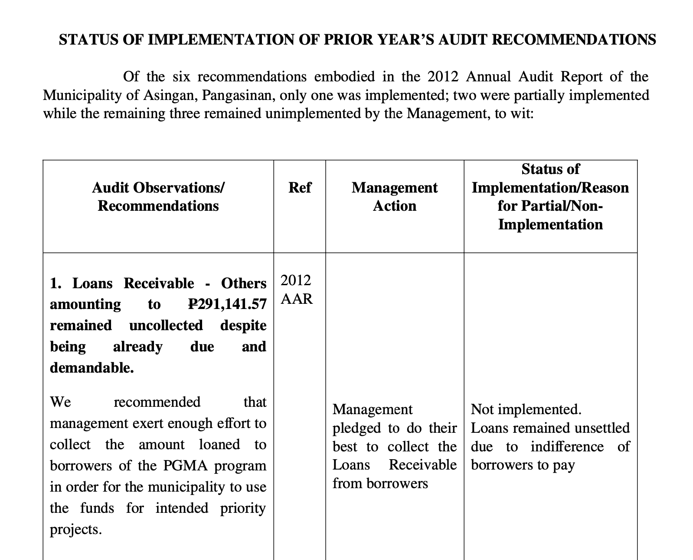
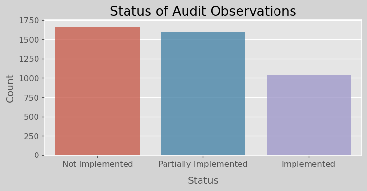
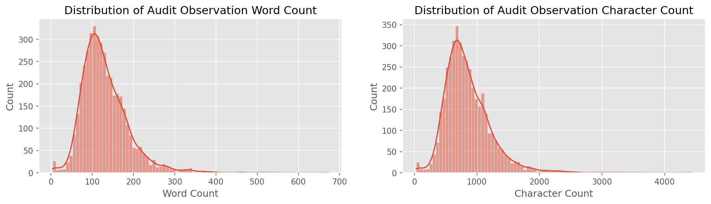
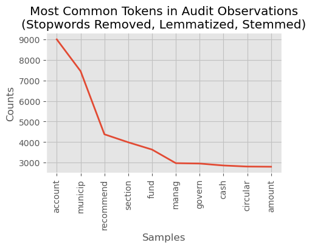
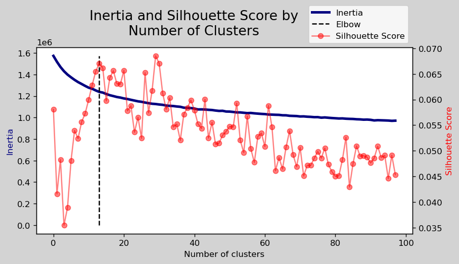
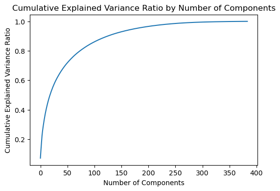
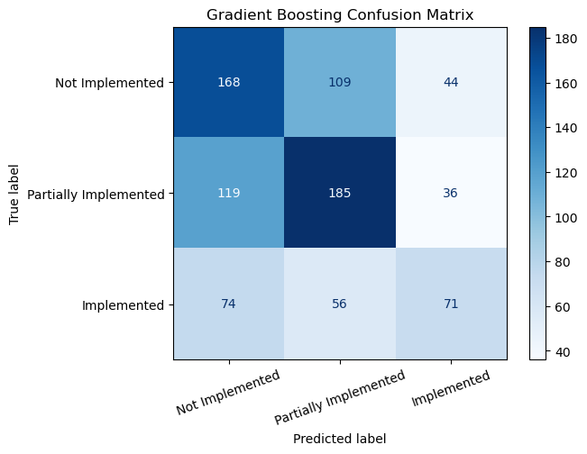

# Phil Analysis

> A Natural Language Processing Suite for the Philippines Audit System

Please install the requirements for this project before running the code. You can do this by running the following command in your terminal:

```bash
pip install -r requirements.txt
```

## Table of Contents

- [Phil Analysis](#phil-analysis)
  - [Table of Contents](#table-of-contents)
  - [Introduction](#introduction)
  - [A Natural Language Processing Suite](#a-natural-language-processing-suite)
    - [Objective](#objective)
    - [Data Dictionary](#data-dictionary)
  - [Analysis](#analysis)
    - [Data Cleaning](#data-cleaning)
    - [Data Exploration](#data-exploration)
    - [Unsupervised Learning](#unsupervised-learning)
    - [Modeling](#modeling)
    - [Conclusion](#conclusion)

## Introduction

The data for this project comes from a data extraction/engineering application I developed here: [PhilAuditSystem](https://github.com/jackvaughan09/PhilippinesAuditSystem)

I'll give a brief synopsis of what is going on over there to develop the context for the analysis conducted in the following notebooks.

Political and economic development researcher [Mike Denly](https://mikedenly.com/) has been studying codified corruption in the governments of the developing world for years. His current work focuses on categorizing and quantifying corrupt practices via a novel methodology that utilizes government audit reports to detect underhand dealings and legal gymnastics. This practice [works exceptionally well in some cases](https://mikedenly.com/research/audit-measurement).

In late 2022, we discovered a treasure trove of audit reports for the government of the Philippines [posted online](https://www.coa.gov.ph/reports/annual-audit-reports/aar-local-government-units/#167-428-leyte). Unfortunately, the site is guarded against scraping, so we've had to download the some 12,000 reports manually in the form of zip files.

Each zip file contains some file structure that looks like this, for example:

```bash
├── MunicipalityYearAuditReport
│   ├── Auditors_reportYear.docx
│   ├── AuditCertificate.doc
│   ├── AuditStatus-report-year.pdf
│   ├── etc.
└── etc.
```

Inside of files like `Auditors_reportYear.docx` and `AuditStatus-report-year.pdf` are tables containing lists of observations.  

**Example:**



But enough about history, let's get to the analysis!
___

## A Natural Language Processing Suite

The aim of this project is to create a suite of tools for conducting NLP-based analysis on the data as we continue to build out the full sample. Specifically, we want to be able to:

1. Get the data as clean as possible
2. Regularize it via tokenization, lemmatization, etc.
3. Calculate the frequency of words and phrases
4. Generate word embeddings
5. Use the word embeddings to generate predictive and topical models
6. Employ the models to extend corruption typology
7. Eventually use the models to predict the likelihood of corruption in a given audit report

At this stage, we have completed up to step 5: *generating and applying word embeddings to a predictive task.* I've done this to demonstrate the utility of the tools I've built, and to provide a proof of concept for the broader scope of the project.

### Objective

> Create a predictive model using the word embeddings of the audit observations to predict the status of implementation of the recommendations.

___

### Data Dictionary

The following is a list of the columns in the data set and their descriptions.

| Column Name | Data Type | Description |
| ----------- | --------- | ----------- |
| `audit_observation` | `str` | The reported finding from the audit. |
| `recommendations` | `str` | The recommendation from the audit committee to the audited entity |
| `references` | `str` | The reference(s) to which the recommendation of the prior year pertains  |
| `status_of_implementation` | `str` | Whether the recommendation was implemented or not. Can take on 3 values: not implemented, partially implemented, implemented. |
| `reasons_for_partial_or_non_implementation` | `str` | Reasons why the recommendation was not implemented |
| `management_action` | `str` | The action taken by the audited entity to address the recommendation, if any. |

___

## Analysis

### Data Cleaning

The data cleaning process is documented in the notebook [here](notebooks/01_data_cleaning.ipynb).

Data cleaning was a massive undertaking for this project. Due having a limited number of observations in the initial modeling process, I had to go through the data with a fine-toothed comb.  

The data cleaning process involved:

1. Dropping duplicates
2. Missing value investigation
3. Overflow repair
4. Fuzzy logic string matching
5. Mapping the target variable to categorical values

Much of the analysis done at certain points relied heavily upon being able to open up a spreadsheet and do some manual searching to detect patterns in the noise. Fortunately, the dataset is not yet so large as to make this overly cumbersome.

Individual slices of the data that I cracked open in Apple Numbers (no excel here, lads) can be found in the [data exploration folder](/data/exploration/).

### Data Exploration

The data exploration process is documented in the notebook [here](notebooks/02_data_exploration.ipynb).

The data exploration process involved:

1. Exploring the class balance of the target variable



2. Exploring the distribution of the length of the audit observations



3. Token Frequency Analysis

4. N-gram Frequency Analysis

5. Applying Lemmatization and Stemming



> There are additional visualizations in the notebook!

___

### Unsupervised Learning

The unsupervised learning process is documented in the notebook [here](notebooks/03_unsupervised_learning.ipynb).

For the purposes of the project, I really wanted to explore the use of unsupervised learning to engineer features for the predictive model. I was hoping to be able to use the word embeddings to generate clusters of observations that could be used as features in the predictive model.

I spun up an instance of the HuggingFace `all-MiniLM-L6-v2` sentence transformer to create the embeddings. This is a smaller model that is optimized for speed and memory usage, chosen because we are working with a small corpus and we have limited compute resources. For more information on the model, see the [Hugging Face documentation](https://huggingface.co/sentence-transformers/all-MiniLM-L6-v2).

While at this point I am unable to produce a clustering model that is useful for the purposes of the project, I was able to generate word embeddings that seem to be useful for the predictive model.

Results of K-Means clustering:



I then attempted Principal Component Analysis (PCA) to reduce the dimensionality of the embeddings, but the results were not promising. I'm not sure if this is because the model is not robust enough to handle the task, or if the data is not suitable for PCA. I'm inclined to think it's the latter, but I'm not sure.



___

### Modeling

The modeling process is documented in the notebook [here](notebooks/04_modeling.ipynb).

I focused on producing a model with the greatest predictive power, not worrying as much about interpretability of the results because the feature space of word embeddings is already non-interpretable.

I've developed a variety of models, including a Logistic Regression, K-Nearest Neighbors, Gradient Boosted Tree, a Fully Connected Neural Network, and a Bidirectional LSTM.

To evaluate each model, I calculated the Accuracy and F1 scores as the main metrics: Accuracy because it is the most straightforward, and F1-Score as it strikes a good balance between precision and recall. I also measured the ROC AUC score for each model because it demonstrates the model's ability to distinguish between classes. All metrics were computed under 5-fold cross-validation to prevent overfitting and increase inferential power.



The results of the modeling were:

| Model | Train Acc | Test Acc | F1 Score | ROC AUC |
| --- | --- | --- | --- | --- |
| Baseline | N/A | 0.37 | 0.20 | 0.50 |
| Logistic Regression | 0.46 | 0.44 | 0.46 | 0.58 |
| KNN Classifier | 0.44 | 0.43 | 0.45 | 0.58 |
| Gradient Boosting Classifier | 1 | 0.49 | 0.49 | 0.58 |
| Fully Connected Neural Network | 0.48 | 0.48 | 0.48 | 0.50 |
| Bidirectional LSTM | 0.44 | 0.44 | 0.48 | 0.50 |

In summary, the Gradient Boosting Classifier has the best Test Accuracy, F1 Score, and ROC AUC among all models. However, its overfitting issue should be addressed to improve generalization. The Logistic Regression, KNN Classifier, and Bidirectional LSTM models show similar performance levels but are better than the baseline model. The Fully Connected Neural Network has a slightly higher Test Accuracy than the aforementioned models but a worse ROC AUC.

___

### Conclusion

While these aren't the best scores, per se, we are still in the early stages of this project, and we have a lot of room to grow. As we collect more data and improve the pipeline to prevent data loss, we'll continue experimenting with these models.

  I'm quite hesitant in asserting that the models are learning anything about the relationship between the word embeddings and the status of implementation yet. It could just be that they are randomly guessing a bit better than the baseline model.

  In other words, the baseline dummy regressor doesn't even have the ability to "guess" other classes, but the models do! It might be by virtue of access to guessing alternatives that the models outperform the baseline.
  
- To test this in the future, we can create a few alternative baseline models to validate our test results against.

>Though it's not quite clear at this point, if the models **are** learning something, support for  this claim is found in the models' marked improvement (2x) in F1 Score from the dummy classifier (baseline).

 My suspicion is that if this were converted to a binary classification problem with the category being fully implemented/not fully implemented, then the models would see a significant increase in performance

___
